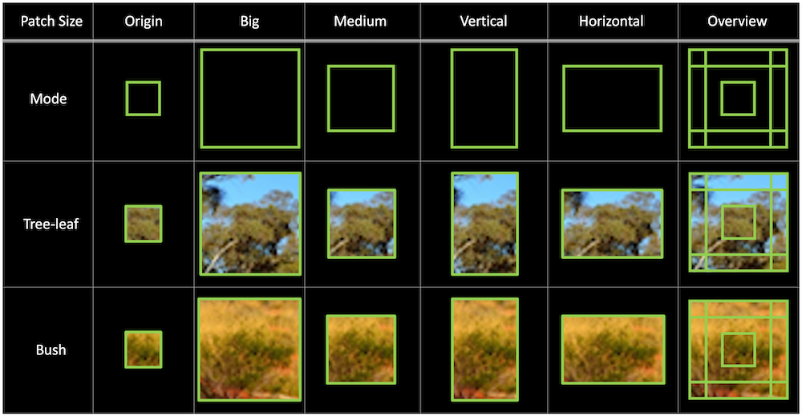

# context-weighted-segmentation

 image segmentation using voting algorithm based on trained classification CNN weight. This methodology allows segmentation to consider context of neighbour pixels on its classification stage. 

## INTRODUCTION

 Often times, classification meets hard decisions especially when the image has multiple class of objects with similar features. In that situation, it would be even easier to decide if the given image input has the context of the whole image. Let's see an example challenge ↓ 

  
Figure 1. example challenge with 2 classes; bush and tree-leaf. (image from [1])  

 Let's suppose we have thousands of Australian outback images and we want to qantitate the coverage of bush and tree-leaf to control bush fire and vegetation growth. In the given example, we have two classes which look pretty similar at patch level : bush and tree-leaf. 

 

|label  |bush   |tree-leaf      |
|-------|-------|---------------|
|image|||

Table 1. look alike patches to be classified.

 They look alike in the patch level which makes the classifier hard to decide (lowering confidence). However, it would be even more accurate if the classifier can get the nearby objects (neighbor pixels) which give some clues of the target object such as 'sky', 'ground', and 'branch' like below. ↓ 

|label  |bush   |tree-leaf      |
|-------|-------|---------------|
|origin |||
|context|||

Table 2. allowing origin patches to be in context by inclduing nearby piexels.

## IDEA

 So I decided to grant 'second chance' for those classified patches with low confidence under a certain threshold (70%). In this 'second chance', classification will be rerun with additional four patches which include neighbor area in different shape: big, medium, vertical, horizontal ↓ 

  
Figure 2. Different modes for each ambiguous patch.

 When the trained model process all of those modes, the classification result will be varied. This variation will be reflected to the final classification array by adding weights for each mode. 

 
(To be continue...)

## IMPLEMENTATION of WEIGHTING

In the current implementation, weighting is calculated as following :  

$$ R(origin) * 0.4 + R(mid) * 0.3 + R(big) * 0.1 + R(vertical) * 0.1 + R(horizon) * 0.1 $$

 Let R(mode) represent array of inference result for each class where mode is either one of origin, big, mid, vertical, and horizon which represent each of the window sizes used for classification. 

## TIME COMPLEXITY

 This methodology is not that efficient when the average confidence of a model (AvConf(model)) is low or confidence threshold (T(conf)) is set to be low because. Both factors will increase the number of this post-processing run. This can be represented as following equation : 

$$ Avg Number Of Vote = AvConf(model) * T(conf) * N(modes) * N(ClassificaitonRun) $$

$$ N(ClassificationRun) = (ImageSize / PatchSize) - PaddingArea $$ 

$$ PaddingArea =  2 * PatchSize * (w + y + 2) $$

## RESULT
|Threshold-0.7     |Threshold-0.8       |
|------------------|--------------------|
|||

Figure 3. Trace of voting at threshold 0.7 and 0.8  

 Figure 3 shows the trace of voting which shows where voting algorithm is happened. Shown in Figure 3, voting was happened in some ambiguous area not all area. With the higher threshold, the more voting is happened. 

  
Table 3. Change in classification result before and after voting.  

 Table 3 shows the change in classificaiton result before and after voting. Before voting, the highest scored class was 'bush' (69.97%). After the weighted-voting happend, however, the highest scored class was changed into 'tree-leaf' (55.52%). This is because the neighbor area gave more weight to the class. Eventhough the confidence has become even lower than before, the actual resort was more accurate when it is compared with ground truth. 

## COMPARISION with No-Voting System

|No-Voting       |Voting         |
|----------------|---------------|
|||
|||

Table 4. Comparision of Inference result of Voting and non-Voting.  

 As you can see from Table 4, there are some differences in inference result especially in ambiguous area. The used model has 91.67% of test accuracy and 0.8 of confidence threshold is applied for voting trigger to amphasize the difference between the modes.

## FUTURE WORK
* As this is a post-processing methodology, this can also be applied to an object-detection challenge to improve detections with low-confidence.  
* Current code doesn't include padding. But, to maximise the performance of this methodology , padding must be implemented upon the class type.  
* This might have some impact on training dataset. Because of this methodology, it would be even more accurate if the model is trained without ambiguous patch (like in table1)  

## BASE WORK
this work is based on the following project : [patch based classification](https://github.com/boguss1225/classification-patch-base)

## DATA_AVAILABILITY
Used dataset is fully available upon request: jcjc7890@gmail.com

## REFERENCE
[1] https://www.networkbirdlife.org/home/northern-nsw-surveyors-excited-to-find-a-surprise-bird-during-annual-surveys-at-two-bush-heritage-properties-in-2021  
[2] https://www.researchgate.net/publication/251815086_Robust_3D_Texture_Classifier_using_Score_Block_Operations/  
[3] https://www.researchgate.net/publication/221564993_Texture_Classification_using_Multi-Scale_Sncheme/  

