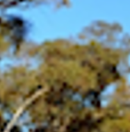

# context-weighted-segmentation

 image segmentation using voting algorithm based on trained classification CNN weight. This methodology allows segmentation to consider context of neighbour pixels on its classification stage. 

## INTRODUCTION

 Often times, classification meets hard decisions especially when the image has multiple class of objects with similar features. In that situation, it would be even easier to decide if the given image input has the context of the whole image. Let's see an example challenge ↓ 

  
Figure 1. example challenge with 2 classes; bush and tree-leaf. (image from [1])  

 Let's suppose we have thousands of Australian outback images and we want to qantitate the coverage of bush and tree-leaf to control bush fire and vegetation growth. In the given example, we have two classes which look pretty similar at patch level : bush and tree-leaf. 

 

|label  |bush   |tree-leaf      |
|-------|-------|---------------|
|image|||

Table 1. look alike patches to be classified.

 They look alike in the patch level which makes the classifier hard to decide (lowering confidence). However, it would be even more accurate if the classifier can get the nearby objects (neighbor pixels) which give some clues of the target object such as 'sky', 'ground', and 'branch' like below. ↓ 

|label  |bush   |tree-leaf      |
|-------|-------|---------------|
|origin |||
|context|||

Table 2. allowing origin patches to be in context by inclduing nearby piexels.

## IDEA

 So I decided to grand 'second chance' for those classified patches with low confidence under a certain threshold (70%). In this 'second chance', classification will be rerun with additional four patches which include neighbor area in different shape: big, medium, vertical, horizontal ↓ 

  
Figure 2. Different modes for each ambiguous patch.

When the trained model process all of those modes, the classification result will be varied. This variation will be reflected to the final classification array by adding weights for each mode.  
(To be continue...)

## FUTURE WORK
[1] As this is post-processing methodology, this can also be applied to object-detection to improve detections with low-confidence.  
[2] Current code doesn't include padding. But, to maximise the performance of this methodology , padding must be implemented upon the class type.  
[3] This might have some impact on training dataset. Because of this methodology, it would be even more accurate if the model is trained without ambiguous patch (like in table1)  

## REFERENCE
[1] https://www.networkbirdlife.org/home/northern-nsw-surveyors-excited-to-find-a-surprise-bird-during-annual-surveys-at-two-bush-heritage-properties-in-2021  
[2] https://www.researchgate.net/publication/251815086_Robust_3D_Texture_Classifier_using_Score_Block_Operations/  
[3] https://www.researchgate.net/publication/221564993_Texture_Classification_using_Multi-Scale_Sncheme/  

